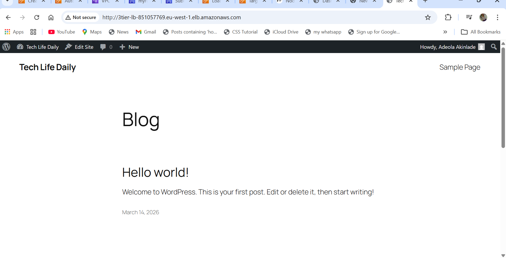

# 🚀 3-Tier WordPress Architecture on AWS

## 📌 Project Overview
This project demonstrates the design and deployment of a **highly available and scalable 3-tier WordPress architecture** on AWS using industry best practices.

The architecture separates the application into three layers:
- Presentation Layer (Web Tier)
- Application Layer
- Database Layer

---

## 🏗️ Architecture Design

### 🔹 Web Tier
- Amazon EC2 instances
- Application Load Balancer (ALB)
- Auto Scaling Group for high availability

### 🔹 Application Tier
- WordPress (PHP-based application)
- Hosted on EC2 instances

### 🔹 Database Tier
- Amazon RDS (MySQL)
- Deployed in a private subnet for security

---

## 🧰 AWS Services Used
- Amazon EC2
- Application Load Balancer (ALB)
- Auto Scaling Group
- Amazon RDS (MySQL)
- Amazon VPC
- Public and Private Subnets
- Internet Gateway & NAT Gateway
- Security Groups

---

## 🌐 Key Features
- High Availability across multiple Availability Zones
- Load balancing for traffic distribution
- Auto Scaling for fault tolerance
- Secure database layer (private subnet)
- Scalable and production-ready architecture

---

## 🧩 Architecture Diagram

## 📸 Screenshots

### 🔹 EC2 Instances

### 🔹 RDS Database

### 🔹 WordPress Application

---

## 🚧 Challenges Faced
- Connecting EC2 instances to RDS in a private subnet
- Misconfigured security group rules
- Database connection issues in WordPress
- Understanding subnet and networking setup

---

## ✅ Solutions
- Fixed inbound/outbound rules
- Correct subnet setup